# Data Providers

Main purpose of Vuetify Admin is to manage remote resources from a given API. As soon as it has to communicate with your backend API for any standardized CRUD operation, it calls the adapted method on your provider that will be responsible for fetching or updating resource data.

```js
// Fetching books
let { data, total } = await provider.getList("books", { page: 1, perPage: 10 });
console.log(data)

// Create new book
await provider.create("books", { data: { title: "My title" } });

// Fetching one book
let { data } = await provider.getOne("books", { id: 1 });
console.log(book)

// Update title book
await provider.update("books", { id: book.id, data: { title: "New title" } });

// Delete book
await provider.delete("books", { id: book.id });
```

All fetching methods of a data provider are standardized in order to ensure compatibility between Vuetify Admin with any API server. This is the adapter pattern which allows all kind of different provider for each type of backend of any exchange protocol, whether it be REST, GraphQL, or even SOAP...



In order to give to Vuetify Admin the ability of fetching remote resource data, you must inject a specific data provider into his constructor as explained in [next chapiter](admin.md).

## API Contract

As always for any adapter pattern approach, all data providers must respect a given contract in order to allow communication with Vuetify Admin. Next object represents the minimal contract that must be implemented :

```js
const dataProvider = {
  getList:    (resource, params) => Promise,
  getOne:     (resource, params) => Promise,
  getMany:    (resource, params) => Promise,
  create:     (resource, params) => Promise,
  update:     (resource, params) => Promise,
  updateMany: (resource, params) => Promise,
  delete:     (resource, params) => Promise,
  deleteMany: (resource, params) => Promise,
}
```

::: tip HIERARCHICAL DATA SUPPORT
Note as you can add additional specific methods for hierarchical data support. See dedicated section on main [treeview component](crud/list.md#treeview) which made use of this methods.
:::

### Supported API operation methods

:::: tabs

::: tab getList
Used for all resources browsing context, as

* [Data iterator component](crud/list.md) for showing list of resources inside data table or any custom list layout component. Should support specific field selection, as well as filtering, sorting and on-demand relation fetching.
* [Export button](crud/list.md#export) for pre filtered resources exporting.
* Auto choices fetching for component that support it as [Autocomplete](components/inputs.md#autocomplete), [Select](components/inputs.md#select), or [RadioGroup](components/inputs.md#radio-group).

> Each getList provider implementation should return the total number of resources along to the data collection. This allows Vuetify Admin to know how many pages of resources there are in total, and build the pagination controls.
:::

::: tab getOne
For showing detail of resource, mainly for [Show page](crud/show.md) or data table show actions.
:::

::: tab getMany
Only used for [Autocomplete](components/inputs.md#autocomplete) in order to fetch all current choices by ids at first load, whether it be on [editing page context](crud/form.md) or [query context filtering](crud/list.md#filter). As opposed to [RA reference field](https://marmelab.com/react-admin/Fields.html#referencefield), the [`VAReferenceField`](components/fields.md#reference) doesn't actually have a the ability of aggregation fetching via getMany by privileging more efficient full server-side eager-loading.
:::

::: tab create & update
Used by [`VaForm`](crud/form.md) for creating new or updating existing resource.
:::

::: tab delete
Simple delete action called when interacting with [`VADeleteButton`](components/buttons.md#delete).
:::

::: tab updateMany & deleteMany
Bulk actions on [list page](crud/list.md). If your backend doesn't support a bulk action API, the simplest way is to push a Promise.all towards all unique simple operation method (update or delete.md) as you will find on Laravel Data Provider source code.
:::

::::

### Translatable resources

In case of a [translatable resource](i18n.md#resource-translation), Vuetify Admin will add an additional `locale` property into `params` object. It's up to you to push this locale context to your API server inside your provider. For instance you can just add a new `locale` parameter in API query string as next : `/books/1?locale=fr`. Then it's the backend to do the remaining job, i.e. fetching the targeted field locale in case of resource reading, or save the text field on targeted locale in case of resource creating/editing.

## Included data providers

Vuetify Admin includes a few different data providers for some common backend that implements previous contract. Each of those translates the VA JS arguments to API calls for fetching data.

You can use it them a base example for implementing yours. If you use standard REST API protocol, only few lines has to be changed, mainly for GET_LIST part and error handling.

### General data provider usage

The usage of included data providers are very similar. As first constructor argument, they can takes either a simple API URL or a custom HTTP client of your choice. Both `axios` or included native `fetchJson` client are compatible. Use full object if you need to share some headers across all admin app, notably useful for any authentication related headers.

#### With simple URL

**`src/plugins/admin.js`**

```js
import { jsonServerDataProvider } from "vuetify-admin/src/providers";

const baseURL = process.env.VUE_APP_API_URL || "https://jsonplaceholder.okami101.io";

export default new VuetifyAdmin({
  ...
  dataProvider: jsonServerDataProvider(baseURL),
  ...
});
```

#### With fetchJson client

`FetchJson` takes the API URL followed by some options are relative constructor arguments. The `options` allows you to share some common generic data across all api calls as authentication headers.

**`src/plugins/admin.js`**

```js
import { jsonServerDataProvider, jwtAuthProvider } from "vuetify-admin/src/providers";
import { FetchJson } from "vuetify-admin/src/providers";

const apiURL = process.env.VUE_APP_API_URL || "http://localhost:8080";

/**
 * Create fetch instance with custom authentication headers
 */
const http = new FetchJson(apiURL, {
  headers: () => {
    let headers = new Headers({
      Accept: "application/json",
    });

    let token = localStorage.getItem("jwt_token");

    if (token) {
      headers.set("Authorization", `Bearer ${token}`);
    }
    return headers;
  },
});

export default new VuetifyAdmin({
  ...
  dataProvider: jsonServerDataProvider(http),
  authProvider: jwtAuthProvider(http),
  ...
});
```

:::tip DYNAMIC HEADERS
For authentication, you may use a function on `headers` for dynamic token fetching.
:::

:::tip CUSTOM CLIENT
If needed you can even have your custom HTTP client that follow generic same contracts as the above one. [Check the source](https://github.com/okami101/vuetify-admin/blob/master/packages/admin/src/providers/utils/fetchJson.js) of `fetchJson`.
:::

#### With axios

**`src/plugins/admin.js`**

```js
import { jsonServerDataProvider } from "vuetify-admin/src/providers";
import axios from "axios";

const baseURL = process.env.VUE_APP_API_URL || "http://localhost:8080";

/**
 * Create axios instance which will send cookies for each request
 */
const http = axios.create({
  baseURL,
  withCredentials: true,
  headers: { "X-Requested-With": "XMLHttpRequest" },
});

export default new VuetifyAdmin({
  ...
  dataProvider: jsonServerDataProvider(http),
  ...
});
```

### API calls

Each next section will describe the VA methods to API calls dialects.

#### Simple REST

[This Data Provider](https://github.com/okami101/vuetify-admin/blob/master/packages/admin/src/providers/data/simpleRest.js) fits REST APIs using simple GET parameters for filters and sorting. This is the dialect used for instance in [FakeRest](https://github.com/marmelab/FakeRest).

| Method       | API calls                                                                  |
| ------------ | -------------------------------------------------------------------------- |
| `getList`    | **GET** `/posts?sort=["title","ASC"]&range=[0, 24]&filter={"title":"bar"}` |
| `getOne`     | **GET** `/posts/123`                                                       |
| `getMany`    | **GET** `/posts?filter={"id":[123,456,789]}`                               |
| `create`     | **POST** `/posts`                                                          |
| `update`     | **PUT** `/posts/123`                                                       |
| `updateMany` | Multiple calls to **PUT** `/posts/{id}`                                    |
| `delete`     | **DELETE** `/posts/123`                                                    |
| `deleteMany` | Multiple calls to **DELETE** `/posts/{id}`                                 |

::: tip TOTAL
The simple REST data provider expects the API to include a `Content-Range` header in the response to `getList` as `Content-Range: posts 0-10/42`.
:::

#### JSON Server

[This Data Provider](https://github.com/okami101/vuetify-admin/blob/master/packages/admin/src/providers/data/jsonServer.js) fits REST APIs powered by [JSON Server](https://github.com/typicode/json-server), such as [JSONPlaceholder](http://jsonplaceholder.typicode.com/).

| Method       | API calls                                                                                       |
| ------------ | ----------------------------------------------------------------------------------------------- |
| `getList`    | **GET** `/posts?_sort=title&_order=ASC&_start=0&_end=24&title=bar&_embed=comments&_expand=user` |
| `getOne`     | **GET** `/posts/123`                                                                            |
| `getMany`    | **GET** `/posts?id=123&id=456&id=789`                                                           |
| `create`     | **POST** `/posts/123`                                                                           |
| `update`     | **PUT** `/posts/123`                                                                            |
| `updateMany` | Multiple calls to **PUT** `/posts/{id}`                                                         |
| `delete`     | **DELETE** `/posts/123`                                                                         |
| `deleteMany` | Multiple calls to **DELETE** `/posts/{id}`                                                      |

::: tip TOTAL
The JSON Server REST Data Provider expects the API to include a `X-Total-Count` header in the response to `getList` as `X-Total-Count: 42`.
:::

#### Hydra REST

[This Data Provider](https://github.com/okami101/vuetify-admin/blob/master/packages/admin/src/providers/data/hydra.js) fits REST APIs powered by [API Platform](https://api-platform.com/) on Hydra dialect.

| Method       | API calls                                                                             |
| ------------ | ------------------------------------------------------------------------------------- |
| `getList`    | **GET** `/posts?page=1&itemsPerPage=15&order={"title":"desc"}&filter={"q":"douglas"}` |
| `getOne`     | **GET** `/posts/123`                                                                  |
| `getMany`    | Multiple calls to **GET** `/posts/123`                                                |
| `create`     | **POST** `/posts/123`                                                                 |
| `update`     | **PUT** `/posts/123`                                                                  |
| `updateMany` | Multiple calls to **PUT** `PUT /posts/{id}`                                           |
| `delete`     | **DELETE** `/posts/123`                                                               |
| `deleteMany` | Multiple calls to **DELETE** `DELETE /posts/{id}`                                     |

::: tip TOTAL
The Hydra REST Data Provider expects the API to include a `hydra:totalItems` included to the Hydra body along to the `hydra:member` property which contains the data collection.
:::

#### Laravel Query Builder

[This Data Provider](https://github.com/okami101/vuetify-admin/blob/master/packages/admin/src/providers/data/laravel.js) fits REST APIs powered by Laravel combined to [Laravel Query Builder](https://github.com/spatie/laravel-query-builder) for resource browsing.

It perfectly fits the backend provided by the official [Laravel Admin](https://github.com/okami101/laravel-admin) composer package as [explained on Laravel guide](laravel.md).

| Method         | API calls                                                                                                               |
| -------------- | ----------------------------------------------------------------------------------------------------------------------- |
| **getList**    | **GET** `/posts?fields[posts]=id,title,summary&include=media&page=1&perPage=15&sort=title,-date&filter={"q":"douglas"}` |
| **getOne**     | **GET** `/posts/123`                                                                                                    |
| **getMany**    | **GET** `/posts?filter={"id":[123,456,789]}`                                                                            |
| **create**     | **POST** `/posts`                                                                                                       |
| **update**     | **PUT** `/posts/123`                                                                                                    |
| **updateMany** | Multiple calls to **PUT** `/posts/{id}`                                                                                 |
| **delete**     | **DELETE** `/posts/1`                                                                                                   |
| **deleteMany** | Multiple calls to **DELETE** `/posts/{id}`                                                                              |

> For `DESC` sorting, we use a simple dash before the sortable field. Multiple sort is supported by simply adding more sortable fields separated by comma.
> The `include` parameter is used for on demand eager loading relation.

::: tip TOTAL
The Laravel Data Provider expects the API to include a `meta.total` property included to the final JSON body along to the data collection.
:::

In order to work, this provider needs an specific `axios` instance at first constructor argument :

**`src/plugins/admin.js`**

```js
import { laravelDataProvider } from "vuetify-admin/src/providers";
import axios from "axios";

const http = axios.create({
  baseURL,
  withCredentials: true,
  headers: { "X-Requested-With": "XMLHttpRequest" },
});

let dataProvider = laravelDataProvider(http)
```

It allows you to have consistent request client across all providers, by taking cookies credentials, set baseURL, adding any custom HTTP headers as JWT token, using axios request interceptors, etc. You can even add specific provider baseURL if needed via second function arguments `laravelDataProvider(http, '/api')`.

::: warning FORM DATA
Laravel Data Provider use classic FormData for all api calls instead of simple JSON. It provides better Laravel integration for file uploads with ready-to-go file validation as well as UploadedFile auto conversion object.  
For better reusability, a dedicated converter is available [here](https://github.com/okami101/vuetify-admin/blob/master/packages/admin/src/providers/utils/objectToFormData.js). To use it for your own provider, simply import it by `import objectToFormData from "vuetify-admin/src/providers/utils/objectToFormData";`
:::

## Writing your own data provider

As seen [previously](#api-contract), each provider method takes 2 arguments :

* `resource` : represents the string name of concerned resource, should be the resource API URL base for each call.
* `params` : a given object adapted for each type of API call.

### Method call signatures

Next board represents what object format you should expects as second `params` function arguments for each provider method.

| Method         | Description                    | Parameters format                                                                                                                                                  |
| -------------- | ------------------------------ | ------------------------------------------------------------------------------------------------------------------------------------------------------------------ |
| **getList**    | Search for resources           | `{ pagination: { page: Number , perPage: Number }, sort: [{ by: String, desc: Boolean }], filter: Object }, include: String[], fields: { [resource]: String[] } }` |
| **getOne**     | Fetch one resource by id       | `{ id: Any }`                                                                                                                                                      |
| **getMany**    | Fetch multiple resource by ids | `{ ids: Array, include: String[], fields: { [resource]: String[] } }`                                                                                              |
| **create**     | Create new resource            | `{ data: Object }`                                                                                                                                                 |
| **update**     | Update existing resource       | `{ id: Any, data: Object }`                                                                                                                                        |
| **updateMany** | Update multiple resources      | `{ ids: Array, data: Object }`                                                                                                                                     |
| **delete**     | Delete existing resource       | `{ id: Any }`                                                                                                                                                      |
| **deleteMany** | Delete multiple resources      | `{ ids: Array }`                                                                                                                                                   |

Here is some valid call examples of Vuetify Admin inside each resource store module :

```js
dataProvider.getList("books", {
  pagination: { page: 1, perPage: 15 },
  sort: [{ by: "publication_date", desc: true }, { by: "title", desc: false }],
  filter: { author: "Cassandra" },
  include: ["media", "reviews"],
  fields: { books: ["isbn", "title"], reviews: ["status", "author"] }
});
dataProvider.getOne("books", { id: 1 });
dataProvider.getMany("books", { ids: [1, 2, 3] });
dataProvider.create("books", { data: { title: "Lorem ipsum" } });
dataProvider.update("books", { id: 1, data: { title: "New title" } });
dataProvider.updateMany("books", { ids: [1, 2, 3], data: { commentable: true } });
dataProvider.delete("books", { id: 1 });
dataProvider.deleteMany("books", { ids: [1, 2, 3] });
```

### Method response formats

Each provider's method must return a Provider on given format.

| Operation      | Response format                       |
| -------------- | ------------------------------------- |
| **getList**    | `{ data: Resource[], total: Number }` |
| **getOne**     | `{ data: Resource }`                  |
| **getMany**    | `{ data: Resource[] }`                |
| **create**     | `{ data: Resource }`                  |
| **update**     | `{ data: Resource }`                  |
| **updateMany** | `empty`                               |
| **delete**     | `empty`                               |
| **deleteMany** | `empty`                               |

::: warning PAGING COUNT
As showed here, in order to make [data iterator](crud/list.md) aware of pager count you'll need to return the total of dataset from server-side.
:::

### Errors handling

In case of any server-side error, i.e. with a response status outside of 2xx range, you just have to return a reject promise with a specific Object with at least a descriptive error message as well as the HTTP status code. This status is transmitted to [auth provider](authentication.md#api-contract) in order to allows you specific auth action according to a given status code.

For best error message explanation, it's common to take the message inside the body response in order to get the real server exception. In case of empty message or empty response from server, we fallback to the generic statusText response.

```js
try {
  let response = await axios.post(url, data);
} catch ({ response }) {
  let { data, status, statusText } = response;
  return Promise.reject({
    message: statusText,
    status,
    ...(data || {}),
  });
}
```

The expected error object format :

| Property    | Type     | Description                                                                                                               |
| ----------- | -------- | ------------------------------------------------------------------------------------------------------------------------- |
| **message** | `string` | The error message that will be shown at snackbar via `VaMessages` component.                                              |
| **status**  | `number` | Response status code, not used by VA but returned on [`checkError`](authentication.md#api-contract) auth provider method. |
| **errors**  | `object` | Use it for [server-side validation support](crud/form.md#server-side-validation).                                         |

### Store

You can use all data provider methods for each resource on your custom CRUD pages or any custom authenticated page directly from the Vuex store. You have 2 different methods, one by the `mapActions` Vuex helper and the other by the global `$store` instance where you can use the `dispatch`. The next piece of code will show an example of both ways to fetch data from your providers :

```vue
<template>
  <v-row>
    <v-col v-for="item in data" :key="item.id">
      {{ item.name }}
    </v-col>
  </v-row>
</template>

<script>
import { mapActions } from "vuex";

export default {
  data() {
    return {
      data: [],
    }
  },
  async mounted() {
    /**
     * Use the global vuex store instance.
     * You need to provide the name of the resource followed by the provider method you want to call.
     * Each provider methods needs a `params` argument which is the same object described above.
     */
    this.data = await this.$store.dispatch("publishers/getList", {
      pagination: {
        page: 1,
        perPage: 5,
      },
    });

    /**
     * Use the registered global method which use global `api` store module.
     * Then you need to provide a object argument of this format : `{ resource, params }`
     */
    this.data = await this.getList({
      resource: "publishers",
      params: {
        pagination: {
          page: 1,
          perPage: 5,
        },
      },
    });
  },
  methods: {
    ...mapActions({
      getList: "api/getList",
    }),
  },
};
</script>
```
