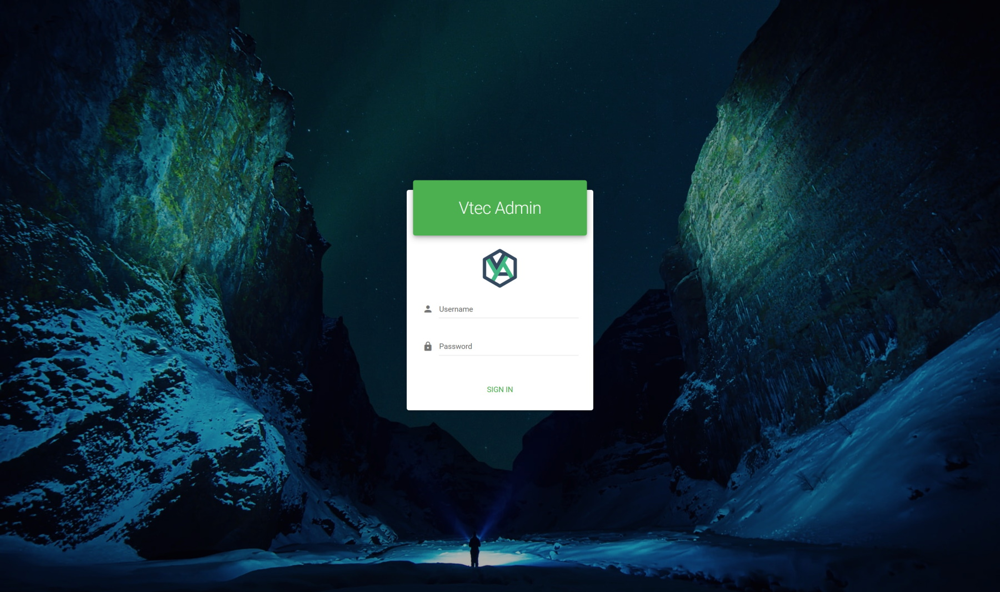
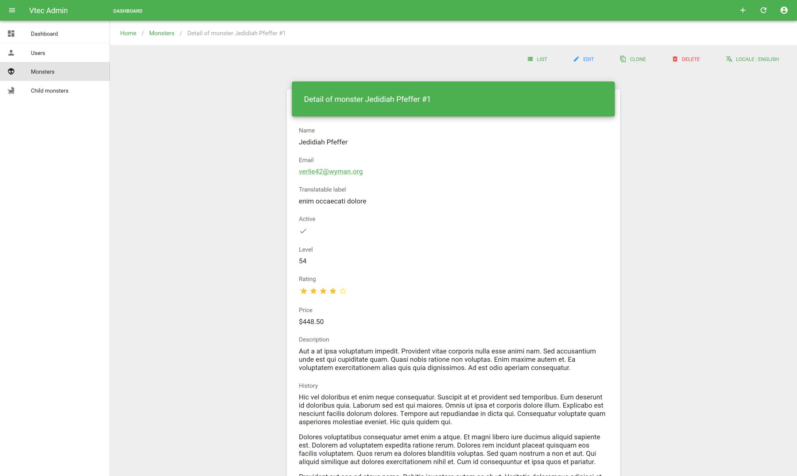

# Laravel

This guide is a demonstration of how official [Laravel Admin](https://github.com/okami101/laravel-admin) can heavily facilitates Vuetify Admin integration within laravel backend for full top to bottom development experience. We will also made usage of server and client code generator commands for YAML driven development showcase. Simply quick and done !

::: warning REQUIREMENTS

* You must have at least PHP 7.2
* [Laravel installer](https://laravel.com/docs#installing-laravel).
* [Vue CLI](https://cli.vuejs.org/guide/installation.html).
* Should be installed on fresh Laravel 7 installation, Laravel 8 isn't supported yet.
* [Docker](https://www.docker.com/get-started) as option.

:::

::: tip SOURCE CODE
You will find complete source code of this tutorial [in the main repo](https://github.com/okami101/vuetify-admin/tree/master/examples/laravel).
:::

## Installation

Simply init your project by this simple steps :

```bash
composer create-project laravel/laravel my-laravel-admin-app 7.*
cd my-laravel-admin-app
composer require okami101/laravel-admin
php artisan admin:install
```

Then follow wizard.

### Required and suggested packages

**Following required packages will be installed :**

* [Laravel Spatie Query Builder](https://github.com/spatie/laravel-query-builder) for api resource browsing with all pagination, fields select, sorting and filters support.
* [Laravel Spatie MediaLibrary](https://github.com/spatie/laravel-medialibrary) for easier centralized media files solution.
* [Laravel Spatie Translatable](https://github.com/spatie/laravel-translatable) for simple translatable model support saved on JSON format.
* [Laracasts Generators](https://github.com/laracasts/Laravel-5-Generators-Extended) for advanced migration with fields and foreign generation feature.

**The installer will suggest you to install :**

* Very helpful optional dev packages as :
  * [IDE Helper](https://github.com/barryvdh/laravel-ide-helper), for IDE integration and laravel intellisense.
  * [PHP CS Fixer](https://github.com/FriendsOfPhp/PHP-CS-Fixer) for coding formatter with Laravel preset.
  * [Clockwork](https://github.com/itsgoingd/clockwork), for easy API profiling.
  * [Dump Server](https://github.com/beyondcode/laravel-dump-server), for CLI dump, ideal for API debugging.
* Other suggested production packages :
  * [Laravel Sanctum](https://github.com/laravel/sanctum), a secured cookie-based authentication for SPA apps, which is ideal for Vuetify Admin.
  * [Laravel elFinder](https://github.com/barryvdh/laravel-elfinder) for file browser support with Wysiwyg bridges.

::: tip IDE HELPER
If you have selected ide helper package, you may add this lines into your main `composer.json` file :

```json
"scripts": {
    "post-update-cmd": [
        "Illuminate\Foundation\ComposerScripts::postUpdate",
        "@php artisan ide-helper:generate",
        "@php artisan ide-helper:meta"
    ]
}
```

:::

### Provided features and generated code

Finally, the installer will integrate some additional boilerplate code to get basic features working within Vuetify Admin :

* Modify some configs as cors for ready-to-go API SPA plugging.
* Impersonation feature
* User controller for admin users management.
* Simple account controller for profile editing and password change.
* Inject docker files with ready to use MySQL, phpMyAdmin, Nginx and Redis !

::: tip SPA auth & impersonation
If you choose to install Laravel Sanctum, the installer will inject both `EnsureFrontendRequestsAreStateful` as well as `Impersonate` middlewares into following Http Kernel file :

**`app/Http/Kernel.php`**

```php {11-12}
<?php

namespace App\Http;

use Illuminate\Foundation\Http\Kernel as HttpKernel;

class Kernel extends HttpKernel
{
    /* ... */
        'api' => [
            \Laravel\Sanctum\Http\Middleware\EnsureFrontendRequestsAreStateful::class,
            \Okami101\LaravelAdmin\Http\Middleware\Impersonate::class,
            'throttle:60,1',
            \Illuminate\Routing\Middleware\SubstituteBindings::class,
        ],
    /* ... */
}
```

Note as `Impersonate` must be placed just right **AFTER** the `EnsureFrontendRequestsAreStateful` middleware in order to fetch initial main authenticated admin user.

:::

### Vue CLI admin UI project

**At the end of installation, a full ready Vue CLI Admin project will be installed inside `admin` sub folder (default) with all required dependencies by using [this preset](https://github.com/okami101/laravel-admin/blob/master/preset.json).**

::: tip UI ADMIN GENERATE COMMAND
You can still regenerate new admin UI without reuse full installer by using `php artisan admin:ui`.
:::

::: tip DIRECTORY STRUCTURE
See [this getting started section](getting-started.md#directory-structure) for more detail of what you get inside the `admin` folder.
:::

## Usage

### Run backend API

#### With docker

After the installation, don't forget to adapt your environment variables with those outputted by installer when finished as following :

```bash
APP_URL=http://localhost:8000
APP_TIMEZONE=UTC

SANCTUM_STATEFUL_DOMAINS=localhost:8080

DB_HOST=mysql
DB_DATABASE=laravel
DB_USERNAME=laravel
DB_PASSWORD=laravel

REDIS_HOST=redis
CACHE_DRIVER=redis
SESSION_DRIVER=redis

DOCKER_PUID=1000
DOCKER_PGID=1000
NGINX_HTTP_PORT=8000
PMA_PORT=9000
MYSQL_ROOT_PASSWORD=root
```

Adapt `SANCTUM_STATEFUL_DOMAINS` to your local url of Vue CLI admin app.

::: warning SANCTUM
`SANCTUM_STATEFUL_DOMAINS` environnement variable is always needed even if admin app is on same API domain. It allows cookie auth sharing between local client app and API server. On production you may set the full domain. For example if your app will be accessible on **https://my.company.com** : `SANCTUM_STATEFUL_DOMAINS=my.company.com`.
:::

::: warning DOCKER_PUID AND DOCKER_PGID
You need to set properly this IDs according to your local linux user IDs in order to prevent all boring permissions issues inside Laravel storage folder. In general the first created linux user is 1000 by default.
:::

You can finally launch `docker-compose up` and take a [pastis](https://en.wikipedia.org/wiki/Pastis). Don't forget to put `docker-compose exec laravel` before each next artisan command.

Then you have to prepare laravel installation with migration and all dummy data (if you have some) :

```bash
docker-compose exec laravel php artisan storage:link
docker-compose exec laravel php artisan migrate:fresh --seed
```

If not included on your dummy data, you may need to create your first user by `docker-compose exec laravel php artisan admin:user admin@example.com`. You will be prompted for the user name and password.

::: tip ADMIN URL
By default admin URL is configured at [http://localhost:8080](http://localhost:8080) which is default Vue CLI dev serve URL.  
Don't forget to edit it on production. Just edit ADMIN_URL environment variable for that.
:::

#### Classic install

First don't forget to put `SANCTUM_STATEFUL_DOMAINS=localhost:8080` inside `.env`, where `localhost:8080` is the default local url of Vue CLI admin app.

Then you have to prepare laravel installation as usual with all migrations and seeders :

```bash
php artisan storage:link
php artisan migrate:fresh --seed
php artisan admin:user admin@example.com # only if no already dummy users from your seeders
php artisan serve
```

### Run Admin UI

You're finally ready to get up and running the Admin UI by `cd admin && yarn serve --open`. It will redirect you to this [customizable login page](authentication.md#login-page) :



After login you will be redirect to this nice static dashboard, which is entirely customizable at `src/views/Dashboard.vue` file :


[Customizable profile page](authentication.md#login-page) that allow basic user editing and password change is also fully functional and available under top right user dropdown menu :


Finally a users section that allows users management with direct aside edit is also provided, as well as possibility of impersonation.


## Generators

This package provides 2 specific crud generator commands. Use `php artisan crud:make [MyNewResource] [options]` with many as options as possible in order to scaffolding following files :

* Model
* Controller with all crud operations
* Policy for authorization
* Store and update requests for validation rules (empty by default, so don't forget to add your own rules)
* Http Resource for API data transformer
* Migration with all pre-generated fields (including foreign !)
* Factory and seeder (empty by default)

In addition, api routes should be registered automatically at `routes/api.php` file in this place :

```php
Route::apiResources([
    /** previous entities */
    'my_new_resource' => 'MyNewResourceController',
]);
```

::: tip HELP COMMAND
Launch `php artisan crud:make --help` for all options documentation.
:::

::: tip IDE AUTOCOMPLETION
Use `php artisan ide-helper:models` after in order to have full model autocompletion !
:::

::: tip OVERRIDES
Use `--force` option for overwrite existing files.
:::

::: tip DATABASE RELATED FILES
For both generator commands, you may add `-mfs` options to generate full migration file with all pre-generated fields, in addition to factory and seeder files.
:::

::: warning RELATIONSHIP
In case of model relation, even if foreign keys can be generated in migration file by `foreign` on schema, you must manually add related eloquent relation in you model.
:::

::: warning VALIDATION
For server-side validation, you must manually add rules to generated store and update request files inside `app/Http/Requests` directory.
:::

## Generate your first entity

You're now ready for development. Let's try the power of above generators for initiate our first entity on API side. We will create a new `Book` model with followed fields : `isbn`, `category`, `title`, `description`, `author`, `price`, `commentable`, `formats` and `publication_date`. We will also set `title` and `description` as translatable fields. So we can use next command :

```bash
php artisan crud:make Book \
  --schema="isbn:string:unique, category:string, title:json, description:json, summary:json, author:string, price:float, commentable:boolean, formats:json, publication_date:date" \
  --translatable="title, description, summary" --searchable="title, description, author" \
  --filterable="title, author, commentable" \
  --sortable="isbn, title, author, price, publication_date" \
  -mfs --force
```

::: warning JSON
As `title` and `description` are translatable, we'll use JSON for storing all localized labels keyed by locale code.
:::

All necessary files are now generated :

:::: tabs

::: tab MIGRATION
**`database/migrations/{timestamp}_create_books_table.php`**

```php
<?php

use Illuminate\Database\Schema\Blueprint;
use Illuminate\Database\Migrations\Migration;

class CreateBooksTable extends Migration
{
    /**
     * Run the migrations.
     *
     * @return void
     */
    public function up()
    {
        Schema::create('books', function (Blueprint $table) {
            $table->increments('id');
            $table->string('isbn')->unique();
            $table->string('category');
            $table->json('title');
            $table->json('description');
            $table->json('summary');
            $table->string('author');
            $table->float('price');
            $table->boolean('commentable');
            $table->json('formats');
            $table->date('publication_date');
            $table->timestamps();
        });
    }

    /**
     * Reverse the migrations.
     *
     * @return void
     */
    public function down()
    {
        Schema::dropIfExists('books');
    }
}
```

> Generated thanks to [Laracasts Generators](https://github.com/laracasts/Laravel-5-Generators-Extended).
:::

::: tab MODEL
**`app/Book.php`**

```php
<?php

namespace App;

use Illuminate\Database\Eloquent\Model;
use Spatie\Translatable\HasTranslations;

class Book extends Model
{
    use HasTranslations;

    protected $fillable = ['isbn', 'category', 'title', 'description', 'author', 'price', 'commentable', 'formats', 'publication_date'];

    protected $casts = ['price' => 'float', 'commentable' => 'boolean', 'formats' => 'array', 'publication_date' => 'date'];

    public $translatable = ['title', 'description', 'summary'];

    protected function getLocale(): string
    {
        return request()->header('locale') ?: app()->getLocale();
    }
}
```

> Guess all fillable, casts, translatable, as well as media (single or multiple) fields. The `getLocale` method is important in order to get the current asked Locale from request header for good targeted locale translation (get or set).
:::

::: tab CONTROLLER
**`app/Http/Controllers/BookController`**

```php
<?php

namespace App\Http\Controllers;

use App\Book;
use App\Http\Requests\StoreBook;
use App\Http\Requests\UpdateBook;
use App\Http\Resources\Book as BookResource;
use Spatie\QueryBuilder\AllowedFilter;
use Spatie\QueryBuilder\QueryBuilder;
use Okami101\LaravelAdmin\Filters\SearchFilter;

class BookController extends Controller
{
    public function __construct()
    {
        $this->authorizeResource(Book::class);
    }

    /**
     * Display a listing of the resource.
     *
     * @return \Illuminate\Http\Resources\Json\AnonymousResourceCollection
     */
    public function index()
    {
        return BookResource::collection(
            QueryBuilder::for(Book::class)
                ->allowedFilters([
                    AllowedFilter::custom('q', new SearchFilter(['title', 'description', 'author'])),
                    AllowedFilter::exact('id'),
                    AllowedFilter::partial('title'),
                    AllowedFilter::partial('author'),
                    AllowedFilter::exact('commentable'),
                ])
                ->allowedSorts(['isbn', 'title', 'author', 'price', 'publication_date'])
                ->allowedIncludes([])
                ->exportOrPaginate()
        );
    }

    /**
     * Display the specified resource.
     *
     * @param  \App\Book  $book
     * @return BookResource
     */
    public function show(Book $book)
    {
        return new BookResource($book->load([]));
    }

    /**
     * Store a newly created resource in storage.
     *
     * @param  \Illuminate\Http\Request  $request
     * @return BookResource
     */
    public function store(StoreBook $request)
    {
        $book = Book::create($request->all());

        return new BookResource($book);
    }

    /**
     * Update the specified resource in storage.
     *
     * @param  \Illuminate\Http\Request  $request
     * @param  \App\Book  $book
     * @return BookResource
     */
    public function update(UpdateBook $request, Book $book)
    {
        $book->update($request->all());

        return new BookResource($book);
    }

    /**
     * Remove the specified resource from storage.
     *
     * @param  \App\Book  $book
     * @return \Illuminate\Http\Response
     * @throws \Exception
     */
    public function destroy(Book $book)
    {
        $book->delete();

        return response()->noContent();
    }
}
```

> Use [Laravel Spatie Query Builder](https://github.com/spatie/laravel-query-builder) for index method, while keeping standard Laravel-ish for other REST methods.
:::

::: tab RESOURCE
**`app/Http/Resources/Book.php`**

```php
<?php

namespace App\Http\Resources;

use Okami101\LaravelAdmin\Http\Resources\BaseResource;

class Book extends BaseResource
{
    /**
     * Transform the resource into an array.
     *
     * @param  \Illuminate\Http\Request  $request
     * @return array
     */
    public function toArray($request)
    {
        return parent::toArray($request);
    }
}
```

> Use [Laravel eloquent resource](https://laravel.com/docs/eloquent-resources) and extend specific LaravelAdmin base resource mainly for translatable and media API handling.
:::

::::

Additional generated files : **BookPolicy**, **StoreBook**, **UpdateBook**, **BookSeeder** and **BookFactory**.

### Dummy data

You may needs to write some factory code for dummy data. Let's write it on next file :

**`database/factories/BookFactory.php`**

```php
<?php

/** @var \Illuminate\Database\Eloquent\Factory $factory */

use App\Book;
use Faker\Generator as Faker;
use Okami101\LaravelAdmin\Faker\Provider\Html;

$factory->define(Book::class, function (Faker $faker) {
    $faker->addProvider(new Html($faker));

    return [
        'isbn' => $faker->isbn13,
        'title' => [
            'en' => ucfirst($faker->words($faker->numberBetween(1, 5), true)),
            'fr' => ucfirst($faker->words($faker->numberBetween(1, 5), true)),
        ],
        'category' => $faker->randomElement(['novel', 'comic', 'cook', 'economy', 'politics', 'history', 'fantasy', 'biography']),
        'description' => [
            'en' => $faker->paragraph(10),
            'fr' => $faker->paragraph(10),
        ],
        'summary' => [
            'en' => $faker->htmlParagraphs(10, 10, 10),
            'fr' => $faker->htmlParagraphs(10, 10, 10),
        ],
        'author' => $faker->name,
        'formats' => $faker->randomElements(
            ['pocket', 'paperback', 'pdf', 'epub', 'kindle'],
            $faker->numberBetween(1, 5)
        ),
        'price' => $faker->randomFloat(2, 10, 50),
        'commentable' => $faker->boolean(80),
        'publication_date' => $faker->dateTime,
    ];
});
```

Now let's add dummy generation on seeder :

**`database/seeds/BookSeeder.php`**

```php
<?php

use Illuminate\Database\Seeder;
use Illuminate\Support\Facades\DB;

class BookSeeder extends Seeder
{
    /**
     * Run the database seeds.
     *
     * @return void
     */
    public function run()
    {
        DB::table('books')->truncate();

        factory(\App\Book::class, 500)->create();
    }
}
```

Finally we can migrate and seed dummy data :

```bash
php artisan migrate
php artisan db:seed --class BookSeeder
```

You're now ready to implement the admin UI !

## Generate CRUD UI

We can of course use the same way of previous tutorials for generate our CRUD book pages via guesser's code, but now you've been thinking can we generate UI side same as previously for API ?

Of course we can ! Vue CLI Plugin will install same separate npm scripts commands but for UI side. Let's try `crud:make` npm script. Go to admin sub folder and launch next `crud:make` command :

```bash
yarn crud:make books --locale="en" --name="Book | Books" --icon="mdi-book" --label="title" --translatable \
  --fields="isbn, category:select, title, description, summary, author, price:number, commentable:boolean, formats:array, publication_date:date" \
  --columns="isbn, title, author, commentable, price, publication_date" \
  --filterable="title, author, commentable" \
  --sortable="isbn, title, author, sortable, publication_date" \
  --lint
```

::: tip HELP COMMAND
Use `yarn vue-cli-service help crud:make` for all options documentation.
:::

It will register a new `books` resource, add link to books on sidebar and generate all CRUD files.

To finish you may readapt some fields or inputs for better representation :

* On list and show views :
  * Add currency format for all **price** fields.
  * Change **summary** of show view to rich text type.
  * Add localized enums for category and formats.
  * Precise `select` on **formats** on show view for use localized enums (as array field don't use it by default).
* On form views :
  * Add `multiline` prop on form for **description** in order to use textarea.
  * Use rich text input for summary (use TinyMCE editor).
  * Use multiple select for `formats` instead of input array.

Here the final code templates of all locales and book CRUD views, all above manual modifications are highlighted.

:::: tabs

::: tab LOCALES
First of all, you're not forced to add label for all fields, as VA will try to humanized them by default from the `source` prop. However for enums, you'll need to add all the list because its help all `VaSelectInput` to get automatically the full choices list from the given source.

**`src/locales/en.json`**

```js {7-25}
{
  //...
  "resources": {
    "books": {
      "name": "Book | Books",
      "fields": {},
      "enums": {
        "category": {
          "novel": "Novel",
          "comic": "Comic",
          "cook": "Cook",
          "economy": "Economy",
          "politics": "Politics",
          "history": "History",
          "fantasy": "Fantasy",
          "biography": "Biography"
        },
        "formats": {
          "pocket": "Pocket",
          "paperback": "Paperback",
          "pdf": "PDF",
          "epub": "Epub",
          "kindle": "Kindle"
        }
      }
    }
  }
}
```

:::

::: tab LIST
**`src/resources/books/List.vue`**

```vue {17,25}
<template>
  <base-material-card :icon="resource.icon" :title="title">
    <va-list :filters="filters">
      <va-data-table :fields="fields"> </va-data-table>
    </va-list>
  </base-material-card>
</template>

<script>
export default {
  props: ["resource", "title"],
  data() {
    return {
      filters: ["title", "author", { source: "commentable", type: "boolean" }],
      fields: [
        { source: "isbn", sortable: true },
        { source: "category", type: "select", attributes: { chip: true } },
        { source: "title", sortable: true },
        { source: "author", sortable: true },
        { source: "commentable", type: "boolean" },
        {
          source: "price",
          type: "number",
          sortable: true,
          attributes: { format: "currency" },
        },
        { source: "publication_date", type: "date", sortable: true },
      ],
    };
  },
};
</script>
```

Final render :


:::

::: tab SHOW
**`src/resources/books/List.vue`**

```vue {14,17,22,25}
<template>
  <va-show-layout>
    <va-show :item="item">
      <v-row justify="center">
        <v-col sm="6">
          <base-material-card>
            <template v-slot:heading>
              <div class="display-2">
                {{ title }}
              </div>
            </template>
            <v-card-text>
              <va-field source="isbn"></va-field>
              <va-field source="category" type="select" chip></va-field>
              <va-field source="title"></va-field>
              <va-field source="description"></va-field>
              <va-field source="summary" type="rich-text"></va-field>
              <va-field source="author"></va-field>
              <va-field
                source="price"
                type="number"
                format="currency"
              ></va-field>
              <va-field source="commentable" type="boolean"></va-field>
              <va-field source="formats" type="array" select></va-field>
              <va-field source="publication_date" type="date"></va-field>
            </v-card-text>
          </base-material-card>
        </v-col>
      </v-row>
    </va-show>
  </va-show-layout>
</template>

<script>
export default {
  props: ["title", "item"],
};
</script>
```

Final render :


:::

::: tab CREATE
**`src/resources/books/List.vue`**

```vue
<template>
  <va-create-layout>
    <books-form :title="title" :item="item"></books-form>
  </va-create-layout>
</template>

<script>
export default {
  props: ["title", "item"],
};
</script>
```

:::

::: tab EDIT
**`src/resources/books/List.vue`**

```vue
<template>
  <va-edit-layout>
    <books-form :id="id" :title="title" :item="item"></books-form>
  </va-edit-layout>
</template>

<script>
export default {
  props: ["id", "title", "item"],
};
</script>
```

:::

::: tab FORM
**`src/resources/books/List.vue`**

```vue {15,16,20}
<template>
  <va-form :id="id" :item="item">
    <v-row justify="center">
      <v-col sm="6">
        <base-material-card>
          <template v-slot:heading>
            <div class="display-2">
              {{ title }}
            </div>
          </template>
          <v-card-text>
            <va-text-input source="isbn"></va-text-input>
            <va-select-input source="category"></va-select-input>
            <va-text-input source="title"></va-text-input>
            <va-text-input source="description" multiline></va-text-input>
            <va-rich-text-input source="summary"></va-rich-text-input>
            <va-text-input source="author"></va-text-input>
            <va-number-input source="price"></va-number-input>
            <va-boolean-input source="commentable"></va-boolean-input>
            <va-select-input source="formats" multiple></va-select-input>
            <va-date-input source="publication_date"></va-date-input>
          </v-card-text>
          <va-save-button></va-save-button>
        </base-material-card>
      </v-col>
    </v-row>
  </va-form>
</template>

<script>
export default {
  props: ["id", "title", "item"],
};
</script>
```

Final render :


:::

::::

## YAML

For even more auto generation power and reusability, a direct resources yaml file descriptor can be used via `php artisan crud:yaml my-new-resource.yml [options]` for API and `yarn crud:yaml my-new-resource.yml [options]` for UI. You can also directly provide a directory which contains all necessary YAML resource descriptor files as needed.

Use `name` option in order to import only targeted resource.

### API & UI resources development

The first step is to create a YAML resource descriptor file that must validate specific [JSON schema](generators.md#json-schema), which will be consumed by API and UI CRUD commands that will generate all basic working code, instead of creating all boring stuff all by hand.

In this tutorial we will use existing YAML files as sample. Take one of this [YAML files descriptors](https://github.com/okami101/vuetify-admin/tree/master/examples/laravel/admin/generators) according to your preferred locale and put it inside `admin/generators` folder (or anywhere you want). This file contains 2 resources :

* Monsters : sample for show all different type of fields.
* Child monsters : essentially for resource relationship purpose.

### API generator commands

::: tip DOCKER
For all next artisan commands, don't forget to add `docker-compose exec laravel` before.
:::

Finally it's time to generate our basic CRUD boilerplate code.

First begin with server-side commands by using `php artisan crud:yaml admin/generators/monsters.en.yml -mfs`. That will generate all API based backend files as well as registering all crud resource API routes. See [laravel specific section](laravel.md#generators) for all detail of what's going on.

### Add specific model relations

Foreign DB keys are already done by migration, but you need to manually add all needed eloquent relationship for each model.

**`app/Monster.php`**

```php
public function children()
{
    return $this->hasMany(MonsterChild::class);
}
```

**`app/MonsterChild.php`**

```php
public function monster()
{
    return $this->belongsTo(Monster::class);
}
```

### Additional dummy data

The next step is to write you seed data. Use generated factory and seeder for that. For get quicker start, pick this files from tutorial source code :

* [MonsterFactory](https://github.com/okami101/vuetify-admin/blob/master/examples/laravel/database/factories/MonsterFactory.php)
* [MonsterChildFactory](https://github.com/okami101/vuetify-admin/blob/master/examples/laravel/database/factories/MonsterChildFactory.php)
* [MonsterSeeder](https://github.com/okami101/vuetify-admin/blob/master/examples/laravel/database/seeds/MonsterSeeder.php)

::: tip USER SEEDER
Take [this user seeder file](https://github.com/okami101/vuetify-admin/blob/master/examples/laravel/database/seeds/UserSeeder.php) in order to not have to create your admin each time you reset the database.
:::

::: tip FILE SAMPLES
For proper media files generation, you may need to download [this sample media directory](../assets/media.zip) and copy this [main DatabaseSeeder file](https://github.com/okami101/vuetify-admin/blob/master/examples/laravel/database/seeds/DatabaseSeeder.php).
:::

::: warning COMPOSER AUTOLOAD
Don't forget to launch `composer dump-autoload` if you don't pass via `php artisan make:seed` command.
:::

Then generate all DB with dummy data by `php artisan migrate:fresh --seed`.

### Server-side data validation

We will not use them for this tutorial, but for real app it's heavily recommended to write your server-side validations on both store and update form requests for each resource (generated inside `app/Http/Requests`).

### UI generator commands

Note at this above commands generate only API side code. For UI side go to `admin` folder and launch `yarn crud:yaml generators/monsters.en.yml --locale en --lint` (for english sample). This will generate all CRUD pages for each entity inside `src/resources` with full searchable data table list, show, create and edit forms.

> In short, only factory, seed data, validation rules and model eloquent relation on server-side has been written by hand.

Now you can run all backend API as well as admin UI and see the result !

Example of generated list of monsters page :


The show view :



And finally the form view :


## Internal services and traits included

### Specific resource base

For API resource definition, you may use [Eloquent Resources](https://laravel.com/docs/eloquent-resources) that extends `Okami101\LaravelAdmin\Http\Resources\BaseResource` in case you need media or translatable fields support within Vuetify Admin.

This class will do 2 things :

* Automatically get only the target locale for each translatable field.
* Fetch some file info (id, title, url,...) with existing thumbnails for each media files attached to the model.

### Available model traits

This package includes some third party request related model traits in order to reduce controller code boilerplate.

#### RequestMediaTrait

This trait will import `HasMediaTrait` from [Spatie MediaLibrary](https://github.com/spatie/laravel-medialibrary) with additional of request file save management.  
This trait will be responsible for taking all valid request files that correspond to a valid collection name, as well as delete asked media for given collection.

Let's take this model media registration :

```php
public function registerMediaCollections(): void
{
    $this->addMediaCollection('logo')->singleFile();
    $this->addMediaCollection('local');
}
```

This trait will automatically search for all `logo` and `local` for uploaded file.  
For media deletion, he looks for `logo_delete` and `local_delete` with valid media ids (can be array or single value).  
The Vuetify Admin file upload component `va-file-input` will take care of all of that.

### Search filter

If you want use global search in [Vuetify Admin Iterator](crud/list.md), use `Okami101\LaravelAdmin\Filters\SearchFilter` with all searchable fields inside allowedFilters method of [Spatie Query Builder](https://docs.spatie.be/laravel-query-builder/v2/features/filtering/) as next :

```php {4}
return new BookCollection(
  QueryBuilder::for(Book::class)
      ->allowedFilters([
          AllowedFilter::custom('q', new SearchFilter(['isbn', 'title', 'description'])),
      ->exportOrPaginate()
    );
}
```

::: tip
Use `exportOrPaginate` specific macro after end of each QueryBuilder in order to add both export and pagination with only one line of code. It will apply pagination only in case of `perPage` detection on request query string. In all cases, filtering and sorting are kept.
:::

### Html Faker provider

You can use `Okami101\LaravelAdmin\Faker\Provider\Html` for easy html generation your factories :

```php {6,15,16}
use App\Book;
use Faker\Generator as Faker;
use Okami101\LaravelAdmin\Faker\Provider\Html;

$factory->define(Book::class, function (Faker $faker) {
    $faker->addProvider(new Html($faker));

    return [
        'isbn' => $faker->isbn13,
        'description' => [
            'en' => $faker->paragraph(10),
            'fr' => $faker->paragraph(10),
        ],
        'summary' => [
            'en' => $faker->htmlParagraphs(10, 10, 10),
            'fr' => $faker->htmlParagraphs(10, 10, 10),
        ],
        //
    ];
});
```
